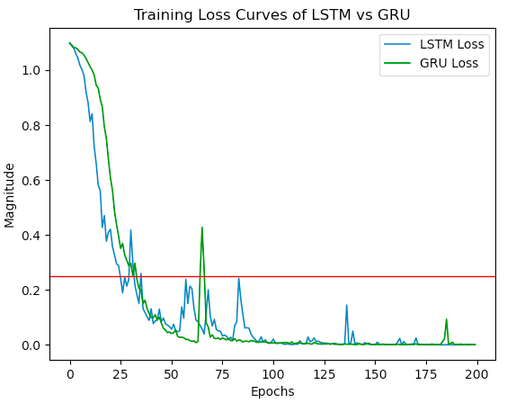
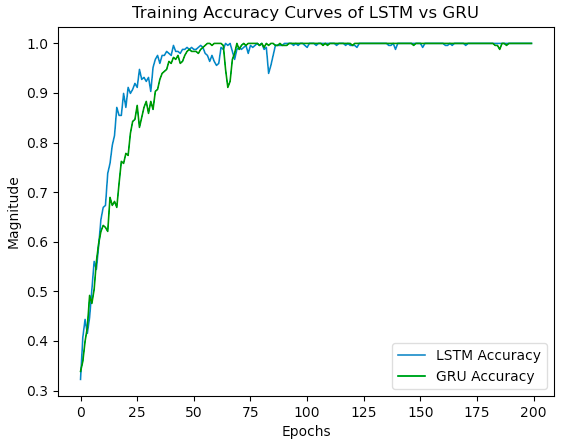
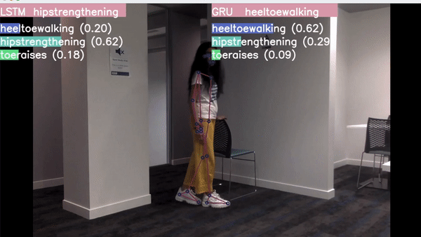

# Motion Similarity Analysis And Medicine Taking Recognition

## <b> Part 4 2021 - Group 26 </b>

### Authors: Sahana Srinivasan (ssri365) and Ninger Gong (ngon152) <br/>

<br/>
This project is part of a research area with HealthBots in the UoA CARES sector. 
<br/>

### <i> OBJECTIVE: </i> To research, analyse and develop an 'exercise and medicine consumption recognition' system for elderly COPD patients to use from the comforts of their home
<br/>

## Project Overview
The UoA CARES HealthBots are developed by the Centre of Automation and Robotics Engineering Science department at the University of Auckland, to engage and assist elderly patients in their day-to-day activities. 

Current work is being done to train these HealthBots to assist COPD patients with reminders to exercise, take their prescribed medications on time as well as to entertain them with puzzles or brain-teasers to keep their minds active. 

> The mission of this project is to extend the functionality of these HealthBots to recognise and predict whether or not prescribed exercises and medications are being taken. A stand-alone system was created to accommodate the two project goals, to later integrate with the HealthBots. In doing so, elderly patients may safely exercise from the comforts of their homes under the virtual supervision of a doctor or physiotherapist, by casting the movements to RoboGen's server.    

How this is done is by using two approaches, split by functionality of exercise recognition and functionality of medicine taking. For the former, a skeleton-based action recognition system was created using a combination of CNNs–for pose detection–and RNNs–as LSTMs and GRUs–for temporal sequence predictions. For medicine taking actions, a VGG16 feature extractor and then an LSTM approach predict an action across a sequence. 

> <b> More information on both approaches is detailed in exercise_recognition and medicine_taking submodules. </b>

The Intel RealSense D435 camera was purchased using the project budget for testing with depth images, but could not be used with lab machines due to lockdown restrictions. 
<br>
<br>

## Table of Contents
=======

* [Project Goals](#project-goals)
* [Poject Structure](#project-structure)
* [Project Requirements and Dependencies](#project-requirements-and-dependencies)
* [Project System Diagram](#project-system-diagram)
* [Project Setup](#project-setup)
* [Dataset](#dataset)
* [Motion Similarity Analysis with Exercise Recognition](#motion-similarity-analysis-with-exercise-recognition)
* [Motion Similarity Analysis with Medicine Consumption Actions](#motion-similarity-analysis-with-medicine-consumption-actions)
* [Training](#training)
* [Testing](#testing)
* [Experimental Results](#experimental-results)
* [References](#references)
<br>
<br>
=======


## Project Goals 
1. Determining if a prescribed exercise is being performed, and to what accuracy
2. Determining if a prescribed medicine is being consumed 
<br>

## Project Structure

This is the structure of our final project. The two project goals have their own packages: exercise_recognition and medicine_taking. <br>

```
→ dataset
    → image_dataset
         → ...
    → keypoint_dataset
         → ...
         
→ exercise_recognition (for exercise actions)
    → ...
→ medicine_taking (for medicine taking actions)
    → ...
→ models
    → ...
→ res
    → ...
→ .gitignore
→ LICENSE
→ README.md
→ run.py
→ train.py
```
<br>

## Project Requirements and Dependencies

### <u> Requirements: </u>
- Visual Studio Code
- Anaconda Navigator
- Python 3.8

### <u> Dependencies: </u>
- certifi==2021.5.30 
- tensorflow==2.4.1
- tensorflow_gpu==2.4.1
- numpy
- opencv-python
- sklearn
- pandas
- matplotlib
- mediapipe
- torch
- torchvision
- tqdm

### Optional Hardware:
- Intel RealSense D435 depth camera
<br>
<br>
=======

## Project System Diagram


<br>

## Project Setup 

1. Clone the repository to your local computer.

2. Use a virtual environment to ensure the right Python version is used:
```
$ conda create -n <env_name> python=3.8
```

3. Activate the environment:
```
$ conda activate <env_name>
(<env_name>)$
```
4. Navigate to the cloned repository destination.

5. Install all dependencies (while virtual environment is active) with either pip or conda using one of the two: 
```
$ pip install <dependency_name>
``` 
(or)
```
$ conda install <dependency_name>
``` 
OR run
```
$ pip install -r requirements.txt
``` 
This should set the project up and running for use.

> 6. **VERY IMPORTANT**: Check that every file in each submodule's folder has the right imports:
```
from <sub-module_name> import <filename_from_submodule>
``` 
and *NOT*
```
import <filename_from_submodule>
``` 

<br>

## Dataset
```
→ dataset
    → image_dataset
         → ...
    → keypoint_dataset
         → ...
```
For the purpose of this project, two datasets were used. One consisted of keypoints (3D co-ordinates) stored in 'keypoint_dataset' and the other used images from 'image_dataset'. 
<br>

### <u> a) For exercise recognition: </u>
```
→ keypoint_dataset (for exercise actions)
    → heeltoewalking
    → hipstrengthening
    → toeraises
```
The 'keypoint_dataset' is used, which consists of image frames obtained from videos and Mediapipe pose co-ordinates as numpy array from the image frames. 
The dataset is available for download at: https://drive.google.com/drive/folders/1QFzp6qWTEdMPRj6z0N8dDHqoJhvUjvxk?usp=sharing 

It consists of three exercise actions: heeltoewalking, hipstrengthening and toeraises. 30 videos for each exercise are obtained, with 30 frames per video. Augmentation was taken into account, adding another 60 videos to the dataset (0.75x scale for videos 31-60 and 1.25x for 61-90).

Extract the five folders (or just the three exercise folders) into ./dataset/keypoint_dataset in this repository. 
<br><br>

### <u> b) For medicine taking recognition: </u>
```
→ image_dataset
    → train
	    → Class 1 (drinking water)
	    → Class 2 (taking medicine)
    → val
	    → Class 1 (drinking water)
	    → Class 2 (taking medicine)
    → _training_logs
```
The frames dataset is used.
The dataset is available to download at:
https://drive.google.com/drive/folders/1jEgdxNEfob2ilfmO_04pKEGoXyEmCGmG

It contains two movements: Drinking water (class 1) and taking medicine (Class 2). The videos for the dataset were taken by webcam. The videos would be preprocessed into 140 frames and divided into train folder and val folder in the data folder. More information would be provided inside the submodule “Taking medicine action” README.md.
<br>
<br>

## Motion Similarity Analysis with Exercise Recognition

```
→ exercise_recognition (for exercise actions)
    → ...
```
### <u> Overview </u>

This skeleton-based approach uses a Mediapipe pose detector, which is a CNN model to detect key landmarks from a human in frame, and extract its features to 3D co-ordinates. These co-ordinates per frame form the dataset. 

The second step is to feed these co-ordinates as features into a specialised RNN that has long-term learning capabilities. For the purpose of this project, LSTMs and GRUs were chosen, and comparisons were made based on predictions using the two. 

More details on this submodule are documented in [./exercise_recognition/README.md](https://github.com/UoA-CARES-Student/MotionSimilarityAndMedicineTakingRecognition/tree/main/exercise_recognition).
<br>
<br>


## Motion Similarity Analysis with Medicine Consumption Actions

```
→ medicine_taking (for exercise actions)
    → ...
```
### <u> Overview </u>
VGG16: a pretrained VGG16 is used as a feature extractor in the system, and the structure of the model is:

More details on this submodule are documented in
[./medicine_taking/README.md](https://github.com/UoA-CARES-Student/MotionSimilarityAndMedicineTakingRecognition/tree/main/medicine_taking).
<br>
<br>

## Training

```
→ train.py
```
The file to execute is train.py in root module (MotionSimilarityAndMedicineTakingRecognition).

1. Ensure the dependencies are consistent. THIS IS VERY IMPORTANT. 
Either submodule ('exercise_recognition' or 'medicine_taking') must have imports that start with 

```
from <submodule_name> import <filename_in_submodule>
```
and NOT
```
import <filename_in_submodule>
```

2. To run the train.py script from main module (MotionSimilarityAndMedicineTakingRecognition), use the following argument structure:

```
$ python train.py --dataset_path <dataset_path> --model_path <model_path> --model_name <model_name> --model_type <model_type>
```
- dataset_path: The absolute path where the downloaded dataset exists.
- model_path (optional): The relative path where the model should be stored, default is ./models
- model_name: Name of the file to store trained weights to (for example: 'new.h5')
- model_type: Type of model ("LSTM","GRU","VGG")

3. If everything was successful, training should begin.
<br>

## Testing 
```
→ run.py
```
The file to execute is run.py in root module (MotionSimilarityAndMedicineTakingRecognition). 

1. Ensure the dependencies are consistent. THIS IS VERY IMPORTANT. 
Either submodule ('exercise_recognition' or 'medicine_taking') must have imports that start with:

```
from <submodule_name> import <filename_in_submodule>
```
For example: 
```
from exercise_recognition import folder_setup
```

2. To run the run.py script from main module (MotionSimilarityAndMedicineTakingRecognition), use the following argument structure:

```
$ python train.py --model_path <model_path> --model_name <model_name> --model_type <model_type>
```
- model_path (optional): The relative path where the model should be stored, default is ./models
- model_name: Name of the file to store trained weights to (for example: 'new.h5')
- model_type: Type of model ("LSTM","GRU","VGG")

3. If everything was successful, testing should begin.
<br>
<br>

## Experimental Results 
During the system implementation, we need to train and test our model, so here are the result:

The training result can be view by Tensorboard:
Motion Similarity Analysis with Exercise Recognition:

Medicine Consumption Actions:
Training:
<div align="center">

<p>- Training accuracy -</p>
</div>

The result of testing would be:
Drinking water          |  Taking Medicine
:-------------------------:|:-------------------------:
 | 

### <u> Motion Similarity Analysis with Exercise Recognition: </u>

Training: 

Both models overfit for 200 epochs. Therefore, Early Stopping is implemented to stop training around 35 epochs, when training loss reaches a threshold of 0.25.

|   Loss Curve  |   Accuracy Curve |
|:--------:|:-----------:|
 | 

GUI: 
Heel-toe-walking  |  Hip strengthening | Toe-raises
:----------------:|:------------------:|:----------:
 |  | 

<br>

### <u> Motion Similarity Analysis with Medicine Consumption Actions: </u>
During the system implementation, we need to train and test our model, so here are the results:

The training result can be viewed in Tensorboard:

Training:
<div align="center">

<p>- Training accuracy -</p>
</div>

The result of testing would be:
Drinking water          |  Taking Medicine
:-------------------------:|:-------------------------:
 | 


## References 
Detailed in submodules (./exercise_recognition/README.md and ./medicine_taking/README.md)
