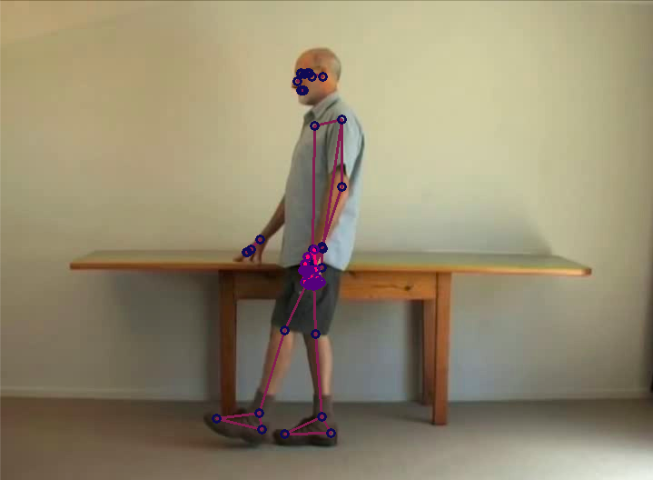
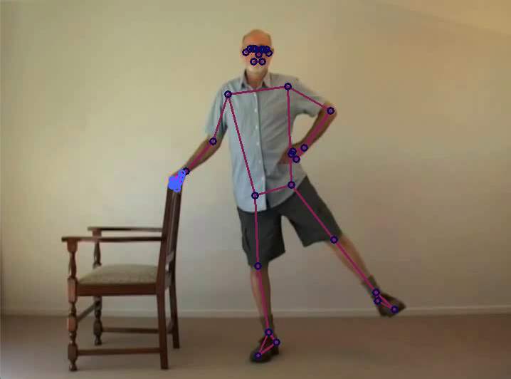
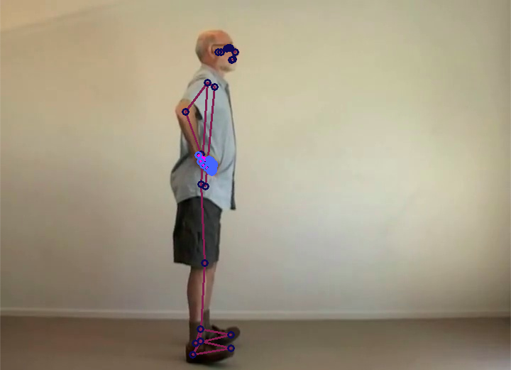
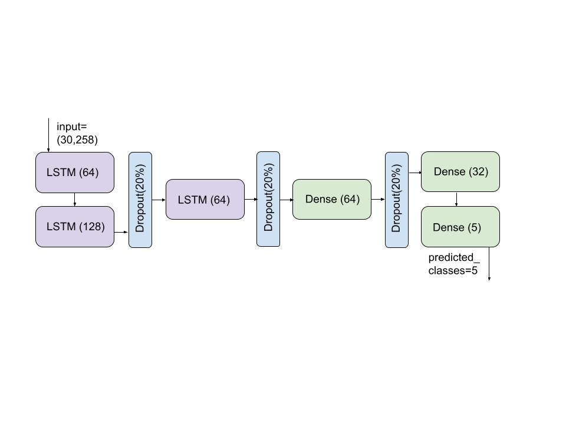
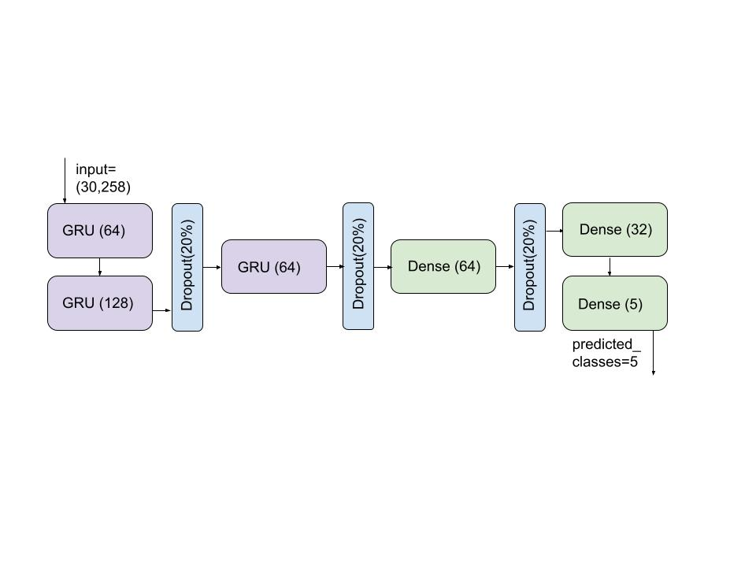

# Motion Similarity Analysis with Exercise Recognition

## <b> Part 4 2021 - Group 26 </b>
<br>

This is the project manual for the exercise recognition system. 

<br/>

> ### <i> SUB-MODULE OBJECTIVE: </i> To develop a system that recognises COPD exercises for patients to exercise independently at home. 
<br/>

# Sub-module Goals: 
- Research, analyse, and compare the various pose estimation algorithms against one another
- Choose a pose and create a dataset 
- Perform feature extraction on the dataset
- Analyse whether to apply principles of transfer learning to a pre-existing model or train a NN model from scratch
- Train and test the model's performance
- Record observations 
<br>
<br>

# Sub-module Assumptions and Limitations: 
## <u> Assumptions: </u>
- Exercises performed outside the range of camera could not be detected
- Exercising accuracies with probability of 1 = perfect pose for exercising

## <u> Limitations: </u> 
- Absence of a GPU machine, all functionality was implemented to be tested on a CPU machine. 
- For an exercise to be correctly recognized, the whole body of the patient had to be in the frame of the camera.
<br>
<br>

# Sub-module Setup:

To ensure that the project will run on your machine, check that the following pre-requisites apply to your operating system. 
- Visual Studio Code 
- Anaconda Navigator
- Python 3.8 

## Hardware:
- Intel RealSense D435 depth camera 
</br></br>

## Create a virtual environment 
1. Clone the repository to your local computer.

2. Use a virtual environment to ensure the right Python version is used:
```
$ conda create -n <env_name> python=3.8
```
3. Activate the environment:
```
$ conda activate <env_name>
(<env_name>)$
```
4. Navigate to the cloned repository destination. For this submodule, ensure the directory you're in is 'exercise_recognition'.

5. Run the requirements.txt file (while virtual environment is active) with either pip or conda using one of the two: 
```
(<env_name>)$ pip install -r requirements.txt
``` 
(or)
```
(<env_name>)$ conda install -r requirements.txt
``` 
5. This should set the project up and running for use.

> 6. **VERY IMPORTANT**: Check that every file in the 'exercise_recognition' folder has the right imports:
```
import <filename_from_submodule>
``` 
and *NOT*
```
from <sub-module_name> import <filename_from_submodule>
``` 

If you want to directly run the program from this point, check the 'Testing/Running' subsection of this manual. 
<br>
<br>

# Sub-module Structure

```
.
├── exercise_recognition
│   ├── models
│   │   └── ...
│   ├── res
│   │   └── ...
│   ├── __init__.py 
│   ├── .gitignore
│   ├── augment.py
│   ├── folder_setup.py
│   ├── mediapipe_interpreter.py
│   ├── obtain_keypoints.py
│   ├── plot_graphs.py
│   ├── preprocess.py
│   ├── README.md
│   ├── requirements.txt
│   ├── test.py
│   └── train.py
└── ...
```
<br>

## Quick File Summaries 

Below are quick summaries of what each file does. A clearer overview is documented in each of the files' headers.

augment.py - augments the dataset by scaling the co-ordinates to 0.75x and 1.25x

[folder_setup.py](https://github.com/UoA-CARES-Student/MotionSimilarityAndMedicineTakingRecognition/blob/main/exercise_recognition/folder_setup.py) - initalises variables that will be used in other parts of the program, and sets up folders for a new dataset path

[mediapipe_interpreter.py](https://github.com/UoA-CARES-Student/MotionSimilarityAndMedicineTakingRecognition/blob/main/exercise_recognition/mediapipe_interpreter.py) - helps with extracting the right co-ordinates from the images and plots them on the image

[obtain_keypoints.py](https://github.com/UoA-CARES-Student/MotionSimilarityAndMedicineTakingRecognition/blob/main/exercise_recognition/obtain_keypoints.py) - gathers Mediapipe co-ordinates and image frames for every video captured from webcam

[plot_graphs.py](https://github.com/UoA-CARES-Student/MotionSimilarityAndMedicineTakingRecognition/blob/main/exercise_recognition/plot_graphs.py) - visualises the accuracy and loss curves from training, with the help of 2 CSV files labelled lossLSTM and lossGRU in ./res directory of submodule.

preprocess.py - preprocesses data from the dataset folder and saves them into numpy arrays of X and y in the ./res folder.

[requirements.txt](https://github.com/UoA-CARES-Student/MotionSimilarityAndMedicineTakingRecognition/blob/main/exercise_recognition/requirements.txt) - stores all the requirements needed to be installed for the correct functioning of the program

test.py - runs the detections of the 2 models on GUI to visualise the prediction probabilities/results   

train.py - trains the preprocessed data, splits them into 92%-8% split and saves the learned weights of the models; also displays confusion matrix, accuracy score, precision score, and F1 score of test data.
<br>
<br>

# Mediapipe

> Mediapipe is an open source ML framework developed by Google.The accuracy it provides is approximately 90%, with near-real time detections at 15 frames per second for CPU machines. 

## <u> Mediapipe 'Holistic': </u>

> Holistic is one such model that contains 543 landmarks, on the face, hands and legs. For the project’s scope, the 468 facial landmarks were omitted, as they have no effect on exercise recognition and to speed up processing time. 

The other 75 landmarks were applied to the dataset, of which 42 are on the hands (with 3D–x, y, z co-ordinates) and 33 form the rest of the body pose (with x, y, z and visibility co-ordinates). 

```
Total co-ordinates = 33 * 4 + 42 * 3 = 258
```
<br>


# Dataset

The dataset for exercise recognition can be downloaded from: https://drive.google.com/drive/folders/1QFzp6qWTEdMPRj6z0N8dDHqoJhvUjvxk?usp=sharing

It is of this structure, in the main directory (MotionSimilarityAnalysisAndMedicineTaking): </br>

```
.
└── keypoint_dataset
    ├── drinkingwater
    │   └── ...
    ├── heeltoewalking
    │   ├── 1
    │   │   ├── 0.jpg
    │   │   ├── 0.npy
    │   │   ├── 1.jpg
    │   │   ├── 1.npy
    │   │   ├── ...
    │   │   ├── 29.jpg    
    │   │   └── 29.npy
    │   ├── ...
    │   └── 30
    │       ├── 0.jpg
    │       ├── 0.npy
    │       ├── 1.jpg
    │       ├── 1.npy
    │       ├── ...
    │       ├── 29.jpg    
    │       └── 29.npy
    │
    ├── hipstrengthening
    │   └── ...
    ├── medicinetaking
    │   └── ...
    └── toeraises
        └── ...

```

- <i> HEELTOEWALKING, HIPSTRENGTHENING, TOERAISES, and each of them have a structure similar to HEELTOEWALKING as illustrated above. </i> 

- Every exercise has 30 videos (found as numbered directories 1-30)  
- Every video has 30 image frames (numbered from 0-29 to avoid confusions between the two) obtained from the RoboGen database, the medical server developed by UoA CARES to deploy information on HealthBots. 

These image frames are sent into Mediapipe and Mediapipe 'Holistic' pose landmarks are applied on the images of every frame. 3D co-ordinates from these frames are stored as numpy arrays. The image frames are also stored as .jpg to be used in other CNN models. 

> To provide some sort of augmentation to the dataset, each of the videos were scaled to 75% (stored as videos numbered from 31-60) and 125% (stored as videos numbered 61-90).  
 
<br> 

Heel-toe-walking  |  Hip strengthening | Toe-raises
:----------------:|:------------------:|:----------:
 |  | 
<br>

## <u> Adding to the dataset </u>

One advantage of this project is that it supports scalability. The exercises created in the dataset were meant to be prototypes. It is possible for the user to add more exercises to the dataset.
<br/>

### 1. <i> In [folder_setup.py](https://github.com/UoA-CARES-Student/MotionSimilarityAndMedicineTakingRecognition/blob/main/exercise_recognition/folder_setup.py) </i>
1. Change the macro 'DATA_PATH' on line 13 to point to the directory containing the keypoint_dataset. If in current directory, use 
```
DATA_PATH = os.path.join(os.getcwd(), "dataset","keypoint_dataset")
```
2. Select a nametag for the exercise. Comment out line 18 and rewrite: 
```
exercises = np.array(['<nametag>'])
```
This nametag (like 'heeltoewalking' for example) will be the identifier of the exercise.  

3. For this submodule, ensure the directory you're in on command line is 'exercise_recognition'. Run folder_setup.py from command line; <i> if import errors arise, go to 'Debugging' of this manual. </i>
```
(<env_name>)$ python folder_setup.py 
```
The above command will make a new folder inside keypoint_dataset with the 'nametag' as specified. It will have 30 folders in it. To customise this number, change line 21 in folder_setup.py.

<b> NOTE: This is not recommended for beginners. </b>

<br/>

### 2. <i> In [obtain_keypoints.py](https://github.com/UoA-CARES-Student/MotionSimilarityAndMedicineTakingRecognition/blob/main/exercise_recognition/obtain_keypoints.py) </i>
1. Note whether the dataset will be created using webcam or using a pre-recorded video. Read the documentation above create_data() and add line 151 with the required arguments for create_data().
```
149 if __name__ == "__main__":
150    # display_data()
141    create_data(<insert_arguments_here>)
``` 
2. For this submodule, ensure the directory you're in on command line is 'exercise_recognition'. Run obtain_keypoints.py from command line. 
```
(<env_name>)$ python obtain_keypoints.py 
```
3. OpenCV should begin capturing frames.
4. If using webcam, perform your movement from when you see "COLLECTING NEW VIDEO" until the next "COLLECTING NEW VIDEO"
5. One video is complete. Similarly repeat for as many number of videos as you need to.
6. Augment the dataset using augment.py; <i> if import errors arise, go to 'Debugging' of this manual. </i>
```
(<env_name>)$ python augment.py 
```
This step generally takes a while, but you should see outputs that say:
```
Scaled coordinates for <exercise> by 0.75
Scaled coordinates for <exercise> by 1.25
```
7. Finally run preprocess.py before training to ensure the dataset has been loaded into numpy arrays for train and test sets; <i> if import errors arise, go to 'Debugging' of this manual. </i> 
```
(<env_name>)$ python preprocess.py 
```
This script should print a label map, indexing the exercises from 0 to n-1.

<br>


# RNNs 
Recurrent Neural Networks make predictions on sequences. They: 
- model and analyse patterns, and
- process behaviour of a feature across frames of a video or across a time frame. 

> For motion recognition in particular, RNNs have shown remarkable performances on learning features. However, standard RNNs pose: 
> - a vanishing gradient problem, that caps the learning of a deep neural network, or 
> - explode gradients, in which the loss keeps compounding and is unable to learn features over sequences. 

Two architectures were chosen that overcome this problem, and were compared against one another. 
<br>
<br>

## LSTMs 
LSTM networks are a special kind of RNN that overcome the vanishing gradient problem, and learn features over a longer period of time. 

The steps involved in these networks are:
- updating an old memory location with a more recent result, and 
- resetting the location to allow more input information

This process differentiates LSTMs from other RNNs and controls error flow into the system. 

> Framewise action recognition has been successful with the use of LSTMs and identifying the correct action being performed. 

The LSTM architecture used is shown below: 


<br>
<br>


## GRUs 
GRUs are a special kind of RNN that predict sequences and overcome the vanishing gradient problem by using only two gates. They are ‘update’ and ‘reset’, where:
- ‘update’ decides what information must be added to the sequence, and 
- ‘reset’ acts as the input gate whose control depends on ‘update’ 

> Two gates decrease the computation time, and happens to be more efficient on a sequence. These networks hold memory for long-term purposes without using a ‘memory unit’ by deciding to hold the right inputs and pass it down to the next layers of the network. For this reason, there is no abstraction of information, data is exposed without any control. 

The GRU architecture used is shown below: 



<br>
<br>

# Training

The script train.py is called to train the system and its models on the dataset. 

1. Ensure all exercises that will be identified are listed in line 21 of folder_setup.py. For the three exercises, this is:
```
exercises = np.array(['heeltoewalking','hipstrengthening','toeraises'])
```
2. Run preprocess.py to load the right data into train and test subsets; <i> if import errors arise, go to 'Debugging' of this manual. </i>
3. For train.py, two variables are of importance: train on line 35 and RNN_type on line 37. 
```
train = True
```
Setting train to 'True' will train the model on the selected dataset (from folder_setup.exercises list) from scratch, while 'False' loads a model with pre-existing weights. 
```
RNN_type = folder_setup.train_types[<index>]
```
In [folder_setup.py](https://github.com/UoA-CARES-Student/MotionSimilarityAndMedicineTakingRecognition/blob/main/exercise_recognition/folder_setup.py), both LSTM and GRU entries exist for 'train_types'. Selecting 0 as index for RNN_type chooses the LSTM model whle 1 for index is GRU.
Change these variables to the preferred ones. 

4. By default, the models are stored in the directory ./models under the sub-module. To change this, check lines 161, 166, 170 and 173 and make the necessary changes to the 'os.path.join(loc,"models")' parameter for the use-case that fits your trials. 
5. If training from scratch, the losses per epoch will be stored in CSV files in the directory ./res of the sub-module as 'lossLSTM.csv' or 'lossGRU.csv'. To change the location where these are saved, check lines 160 and 165 to make the necessary changes. 
6. For this submodule, ensure the directory you're in on command line is 'exercise_recognition'. Then, run train.py from command line; <i> if import errors arise, go to 'Debugging' of this manual. </i> 
```
(<env_name>)$ python train.py 
```

## Logs 

The ./logs folder is created in submodule when training begins from scratch, and stores any TensorBoard related information that may be accessed during training. 

To access during training, open a command line window.

1. Ensure the conda environment is activated and that the cloned repository has been navigated into.

2. Run:

```
$ tensorboard --log_dir ./logs
```
It should prompt you with a localhost link where the data is being hosted. Open it in your browser to visualise the training curves. 
<br>
<br>

# Testing/Running

The test.py script shows prediction probabilities on the GUI, of an exercise performed on the webcam.

The metrics that the program tested for test data were:
- confusion matrix of test set samples, 
- accuracy score of test set, 
- precision score of test set, and 
- F1 score on test data. 

1. You should have already installed these dependencies on the virtual environment. Run these commands on the activated environment to recheck their installations.  
```
(<env_name>)$ pip install tensorflow==2.4.1 opencv-python mediapipe sklearn matplotlib pandas
```
- If GPU system, also run: 
```
(<env_name>)$ pip install tensorflow-gpu==2.4.1 
```
2. Ensure all exercises that will be identified are listed in line 21 of folder_setup.py. For the three exercises, this is:
```
exercises = np.array(['heeltoewalking','hipstrengthening','toeraises'])
```
3. Before running test.py, it is important to understand what will be called when the script is run. In test.py, by default, both LSTM and GRU models are called to run parallely and compare their performances. 

Ensure that both the LSTM and GRU models have been created and their weight files are in ./models directory of the sub-module. If not, change line 211 and 214 to load the exact models and their locations.
```
209 if __name__ == "__main__":
210     model1 = train.define_model("LSTM")
211     model1 = train.load_model(model1,"LSTMexercises.h5",os.path.join(loc,"models"))
212     test_predictions_on_test_set(loc,model1,"LSTM")
213     model2 = train.define_model("GRU")
214     model2 = train.load_model(model2,"GRUexercises.h5",os.path.join(loc,"models"))
215     test_predictions_on_test_set(loc,model2,"GRU")
216 
217     test_detections(model1,model2)
```
Make any necessary changes to the lines. If only one model needs to be tested, use only one model parameter in test_detections(). 

NOTE: test_predictions_on_test_set() only prints out the 4 calculated metrics for the test dataset. 

4. The prediction probabilities of the models can be stored as CSV files for calculation purposes in ./res directory of the sub-module as '[predictionsmodel1.csv](https://github.com/UoA-CARES-Student/MotionSimilarityAndMedicineTakingRecognition/tree/main/exercise_recognition/res/predictionsmodel1.csv)' and '[predictionsmodel2.csv](https://github.com/UoA-CARES-Student/MotionSimilarityAndMedicineTakingRecognition/tree/main/exercise_recognition/res/predictionsmodel2.csv)'. To enable this, uncomment lines 135-137 and lines 146-148. 
5. Once everything seems perfect for the use-case, run test.py on the command line; <i> if import errors arise, go to 'Debugging' of this manual. </i>
```
(<env_name>)$ python test.py 
```
<br>

# Results

## Training

Both models overfit for 200 epochs. Therefore, Early Stopping is implemented to stop training around 35 epochs, when training loss reaches a threshold of 0.25.


<br>
<br>

## Test data

### <u> Confusion matrices </u>


<br>
<br>

### <u> Metrics </u>	

| Model | Accuracy | Precision | F1 Score |
| ----- | -------- | --------- | -------- |
| LSTM  | 95.45%   | 93.33%    | 94.85%   |
| GRU   | 95.45%   | 96.3%     | 95.82%   |

<br>

## Near-real time GUI 

Heel-toe-walking  |  Hip strengthening | Toe-raises
:----------------:|:------------------:|:----------:
 |  | 

<br>

# Future Work 
- Include depth images and predictions, especially using depth to extract features 
- Facial landmark support with the Holistic model, to detect any strain patients may experience when they exercise 
- Adding more movements of exercises and integrating them with the current system  
<br>


# Debugging 
- If any import errors arise when running any script from within this folder, ensure that ALL files in this sub-module have imports that are of the form: 
```
import <filename_from_submodule>
``` 
and *NOT*
```
from <sub-module_name> import <filename_from_submodule>
``` 
**DO NOT CHANGE PYTHON LIBRARY IMPORTS TO THIS FORMAT.**

<br>

# Reference Links:
- Mediapipe: 
    - https://google.github.io/mediapipe/solutions/holistic.html
    - https://ai.googleblog.com/2020/08/on-device-real-time-body-pose-tracking.html
- LSTMs: https://github.com/kinect59/Spatio-Temporal-LSTM 
- Action Recognition using Mediapipe Co-ordinates: https://github.com/nicknochnack/ActionDetectionforSignLanguage
- Frame-wise Action Recognition: https://github.com/TianzhongSong/Real-Time-Action-Recognition 